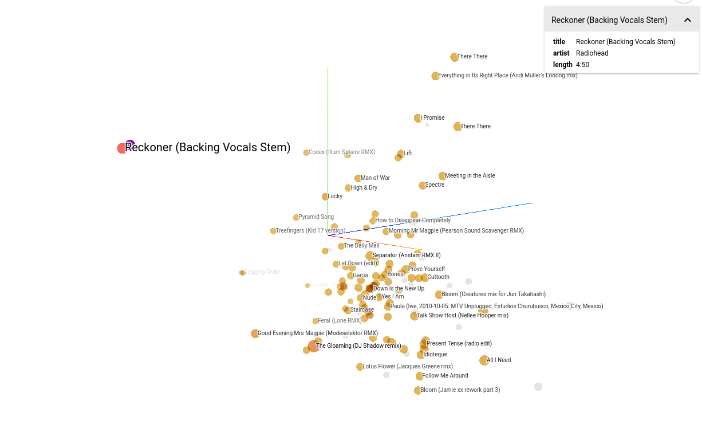

# chromaprint2vec

The project, for the moment, contains 2 main modules to convert music content into vectors that can be used to get distances between recordings or to be visualized via embedding-projector:
- `chromaprint2vec`: gets encoded chromaprints from text files as input
- `audio2vec`: gets audio files as input

Moreover, the following helper modules have been developed:
- `chromaprint_crawler.py`: crawls musicbrainz.org and acoustid.org to generate an index of chromaprints for the selected artists. To feed `chromaprint2vec.py`
- `chromaprint_crawl_anomalies.py`: crawls musicbrainz and acoustid to detect anomalies, by calculating distances between chromaprints associated to same recording
- `pychromaprint.py`: python reimplementation of `fpcalc` to get the chromaprint of an audio file
- `pychromagram.py`: extracts chromagram from an audio file
- `chromaprint2chromagram`: tries to infer chromagram from an existing chromaprint
- `gen_chromagram_dataset`: simulates a chromagram dataset. It's been used by chromaprint2chromagram

And also `chromaprint_utils.py` and `chromagram_utils.py`, for reusability.

[Visualize with the embedding-projector](https://muoten.github.io/embedding-projector-standalone/). *Not optimized for mobile devices or portrait mode. A minimum resolution of 1024x768 is required* 

[](https://muoten.github.io/embedding-projector-standalone/)

## How to use

### Prerequirements
How to install `chromaprint` library:
- Ubuntu/Debian
```
sudo apt update
sudo apt install libchromaprint-tools
```
- macOS (via Homebrew)
```
brew install chromaprint
```
- Run `fpcalc`
- Confirm `python -c import chromaprint` doesn't raise any error

How to install `ffmpeg` library:
- Ubuntu/Debian
```
sudo apt install ffmpeg
```

- macOS (via Homebrew)
```
brew install ffmpeg
```